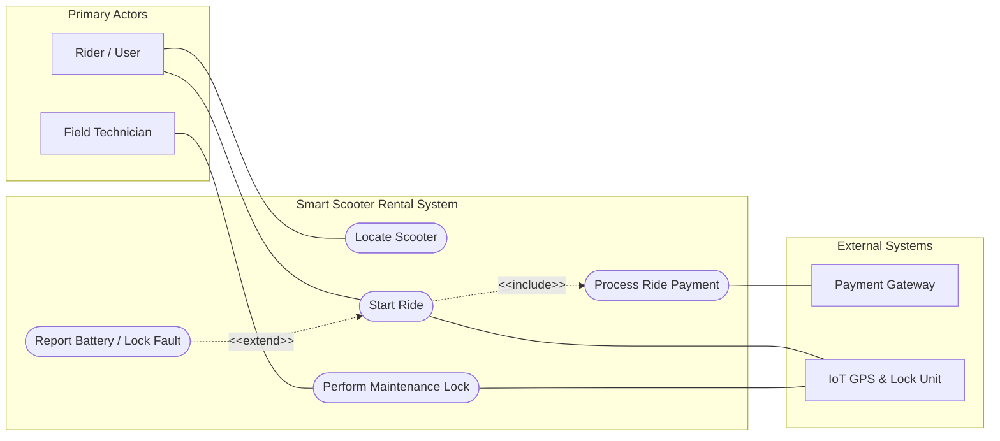

# Requirements & System Modeling

## Use Case Diagram

```mermaid
flowchart LR
    %% Primary Actors
    subgraph Primary_Actors [Primary Actors]
        Rider[Rider / User]
        Technician[Field Technician]
    end

    %% System Boundary
    subgraph ScooterRentalSystem ["Smart Scooter Rental System"]
        UC_Locate([Locate Scooter])
        UC_StartRide([Start Ride])
        UC_ProcessPayment([Process Ride Payment])
        UC_ReportFault([Report Battery / Lock Fault])
        UC_LockVehicle([Perform Maintenance Lock])
    end

    %% Secondary Actors / External Systems
    subgraph Secondary_Actors [External Systems]
        PaymentGW[Payment Gateway]
        GPS_Lock[IoT GPS & Lock Unit]
    end

    %% UML Associations: Solid lines without arrows
    Rider --- UC_Locate
    Rider --- UC_StartRide
    Technician --- UC_LockVehicle

    %% Dependencies: Dashed arrows with stereotypes
    UC_StartRide -.->|"&lt;&lt;include&gt;&gt;"| UC_ProcessPayment
    UC_ReportFault -.->|"&lt;&lt;extend&gt;&gt;"| UC_StartRide

    %% External Systems Associations: Solid lines without arrows
    UC_ProcessPayment --- PaymentGW
    UC_StartRide --- GPS_Lock
    UC_LockVehicle --- GPS_Lock
```